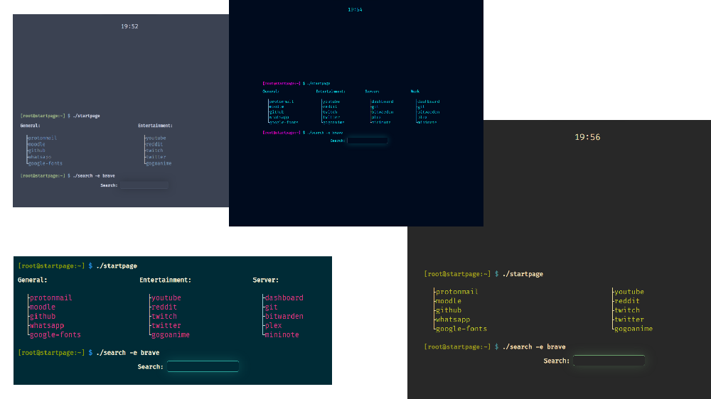

# ./Startpage.sh
A simple tree style startpage in HTML and CSS with interchangeable and customisable themes.



## Installation

### Chrome / Chromium
1. Clone git Repo
2. Go to Extensions
3. Toggle Developer mode on
4. Click on Load Unpacked
5. Select the directory you cloned the git repo

### Firefox
1. Clone git Repo
2. Find instructions on how to install further [here](https://stpg.tk/guides/firefox-startpage/#the-normal-way).

### Safari
1. Clone git Repo
2. Find instructions on how to install further [here](https://support.apple.com/de-de/guide/safari/ibrw1020/mac).

## Configuration

### Themes

#### Choosing themes
1. Open the index.html file in your favorite text editor.
2. Find the line that starts with `<link href="themes/` in the `<head>` section.
3. Replace themes/*theme*.css with your desired theme. Themes can be found in the themes folder.

### Trees

#### Changing tree title
1. Open the index.html file in your favorite text editor.
2. Find your desired tree and look for the `<!--TREE TITLE-->` comment.
3. Replace the text between the `<span>` tags.

#### Changing branch content
1. Open the index.html file in your favorite text editor.
2. Find your desired branch
3. To change the text, replace the content of the `<a>` tags.
4. To change the link change the content of the `href=""` attribute above the text.

#### Adding Branches
1. Open the index.html file in your favorite text editor.
2. Add
```
<li>
    <a href="/link/to/site">
        text
    </a>
</li>
```
before or after another branch.

#### Adding Trees
1. Open the index.html file in your favorite text editor.
2. Add
```
<div class="title rX_REPLACE_ME">
    <h4>
        <!--TREE TITLE-->
        <span class="cmd-cmd">Title:</span>
    </h4>
</div>
<div class="tree rX_REPLACE_ME">
<ul>
    <li>
        <a href="/link/to/site">
            text
        </a>
    </li>
</ul>
```
Where X_REPLACE_ME is the number of your Tree with a maximum of 4.


### Clock

#### Removing Clock
1. Open the index.html file in your favorite text editor.
2. Find and remove the line `<div id="clock"></div>`.

#### Adding Clock
1. Open the index.html file in your favorite text editor.
2. Add the line `<div id="clock"></div>` at the top of the `<body>` section.

#### Changing Clock to American style
1. Open the clock.js file in your favorite text editor.
2. Remove the comments (`/* */`).
3. Remove the comment (`//`) before your desired time format. You can find an explanation for each on the right side of the code.
4. Comment out old Clock style with `//`.

#### Changing Clock back to Normal style
1. Open the clock.js in your favorite text editor.
2. Put a multi-line-comment start (`/*`) before `let period = "AM"`.
3. Put a multi-line-comment end (`*/`) after `period = "PM" }`.

### Search Engine

#### Choosing Search Engine
1. Open the index.html file in your favorite text editor.
2. Find the `<form>` tags
3. Change the content of the `action=""` attribute to your search Engine
4. Change the content of the `name=""` attribute in the `<input>` \
\
Example for startpage search engine:
````
<form action="https://startpage.com/sp/search" method="GET" class="search-form">
    <h4 class="search-title">Search: </h4>
    <input type="text" name="query" autofocus class="search-input" />
</form>
````
5. **Optional**: Find the `<span class="cmd-cmd">./search -e brave</span>` element and change `brave` to your search engine's name.